# materialize-dbt-example
Ingests AIS data in Materialized and displays contents via Metabase.

# schematics
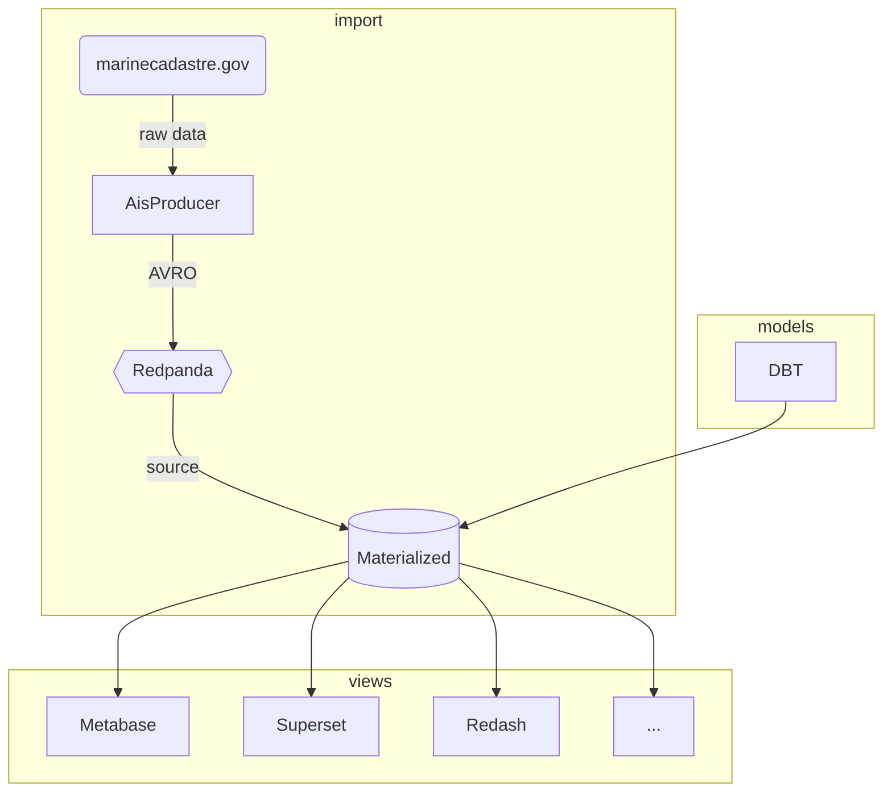

# AIS
https://marinecadastre.gov/ais/
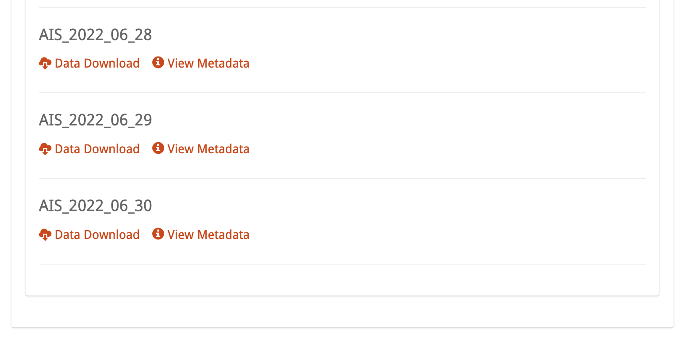

## Raw Data Metadata
https://coast.noaa.gov/data/marinecadastre/ais/data-dictionary.pdf
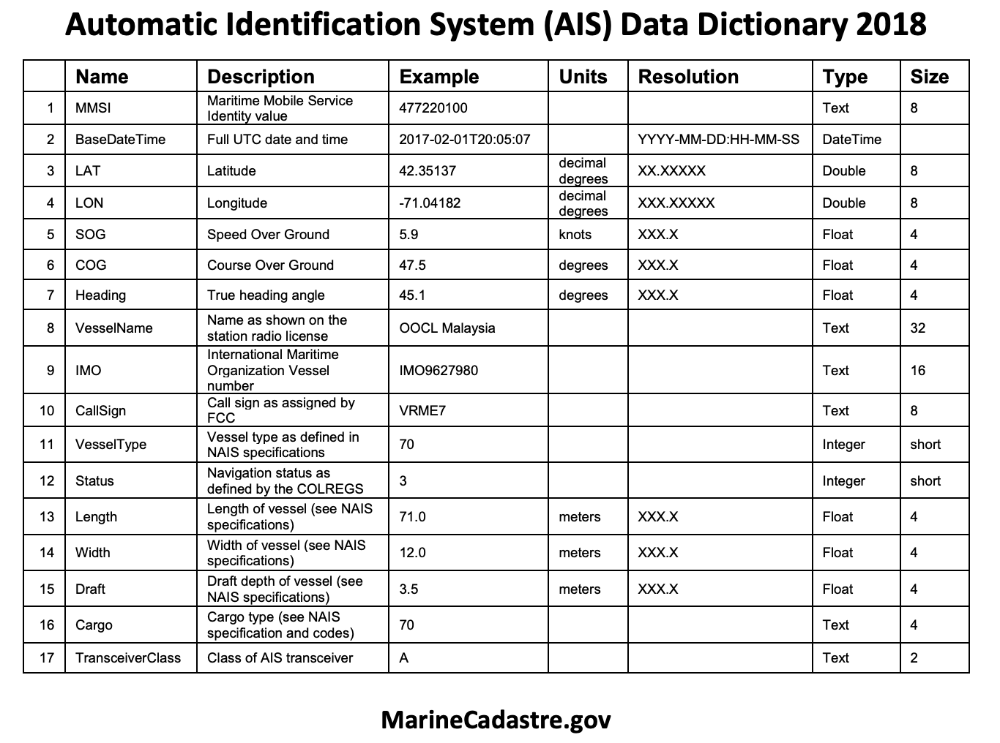

## Raw data
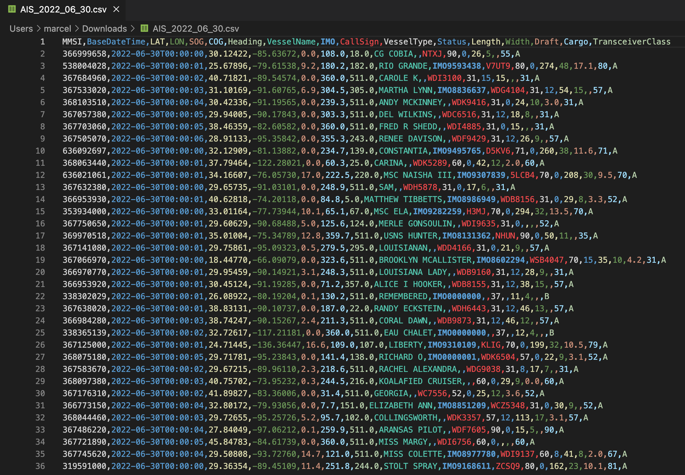

# start applications
```bash
$ docker-compose up -d 
```
# initialize applications 

## upload avro ais schema
stages/1_schemas/avro/avdl/ais_vesseldata.avdl
```bash
$ cd stages/1_schemas &&\
  terraform init &&\
  terraform plan &&\
  terraform apply
```
# verify schema in redpanda
http://localhost:8084/schema-registry/AisVesselData-value
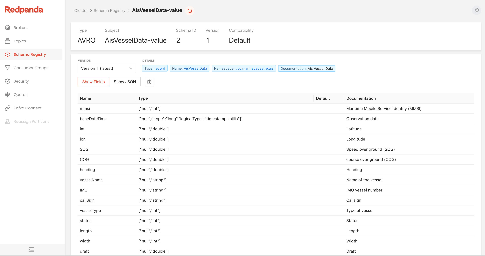

## start dbt connection
```bash
$ cd tages/2_materialize_source_kafka_connection &&
  terraform init &&\
  terraform plan &&\
  terraform apply
```
## verify dbt connection
http://localhost:8085/#!/model/model.example.aisvesseldata#details
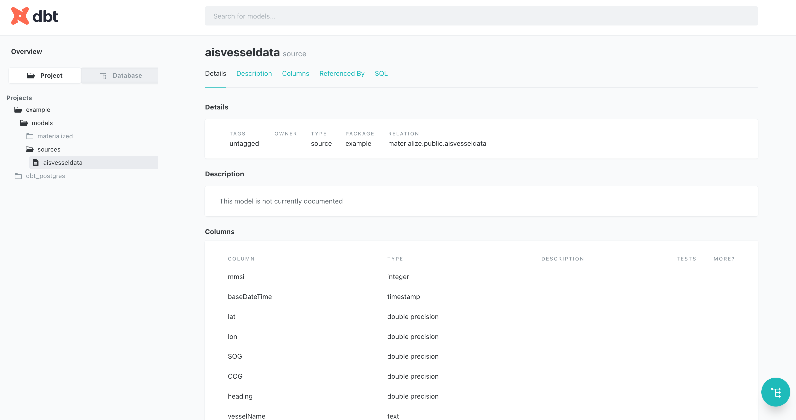

## start ingest
```
$ docker-compose -f docker-compose.yml -f docker-compose-ingest.yml run ingest
```

# verify ingest in redpanda
http://localhost:8084/topics/AisVesselData?o=-1&p=-1&q&s=50#messages
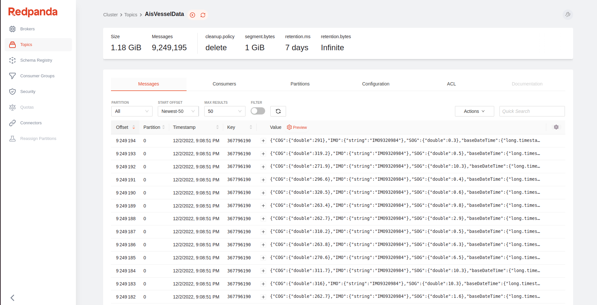

# verify bt
http://localhost:8083


# verify materialized objects
```bash
$ docker-compose exec materialized psql -h localhost -p 6875 -c 'show objects;'
         name          |       type        
-----------------------+-------------------
 aisdata               | materialized-view
 aisvesseldata         | source
 kafka_connection      | connection
 kafka_schema_registry | connection
```
# verify materialized aisdata

```bash
 $ docker-compose exec materialized psql -h localhost -p 6875 -c 'select count(*) from aisdata;'
 count 
-------
    51
(1 row)
```

# metabase
http://localhost:3000

| username | password   |
| -------- |------------|
| user01@metabase.com | password1! | 
 | user02@metabase.com | password2! | 

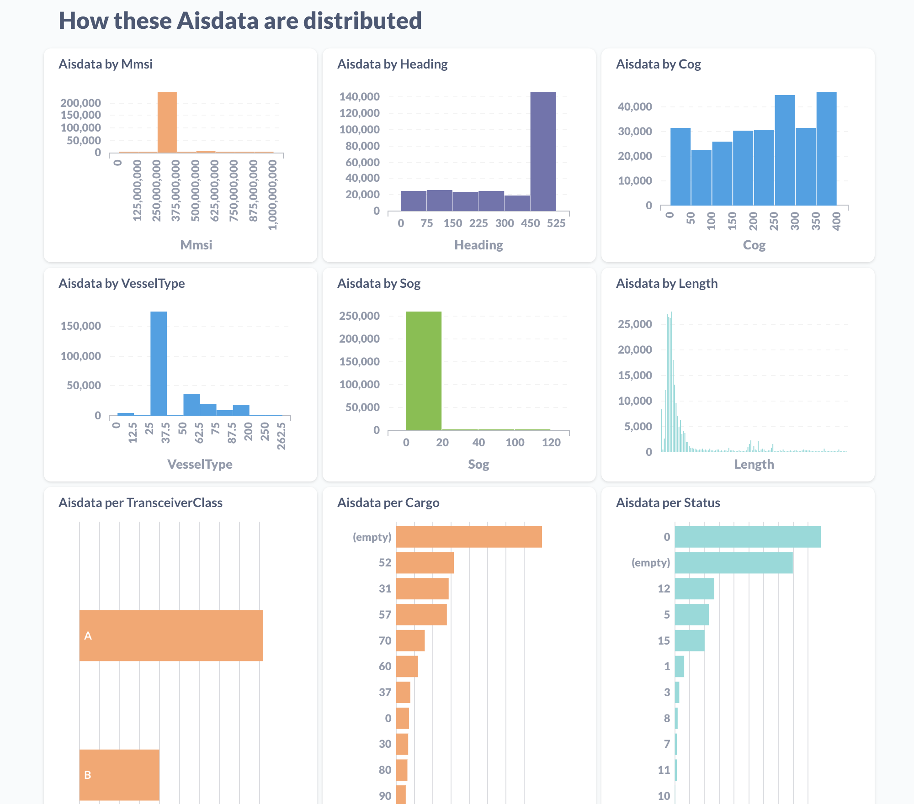
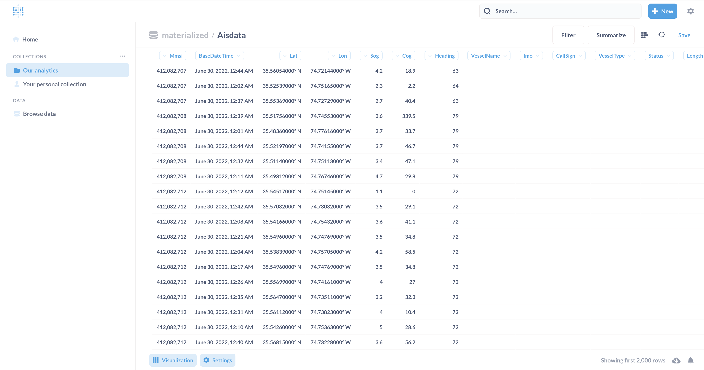
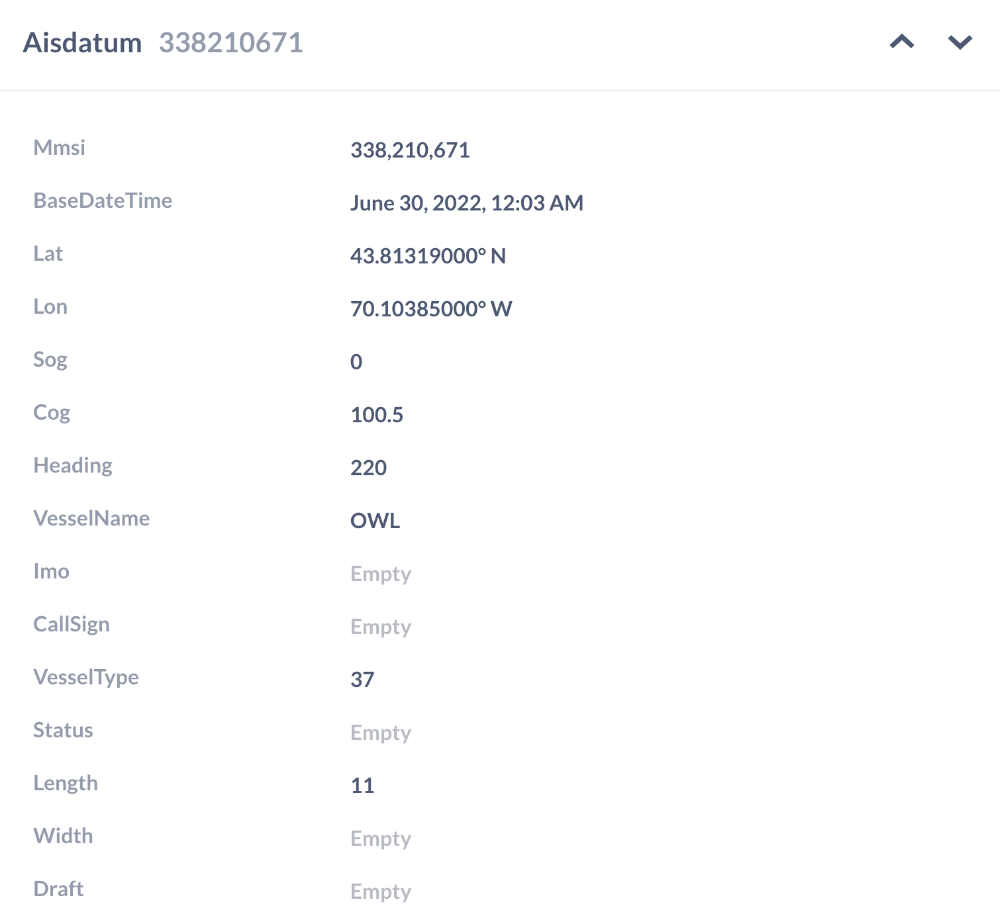
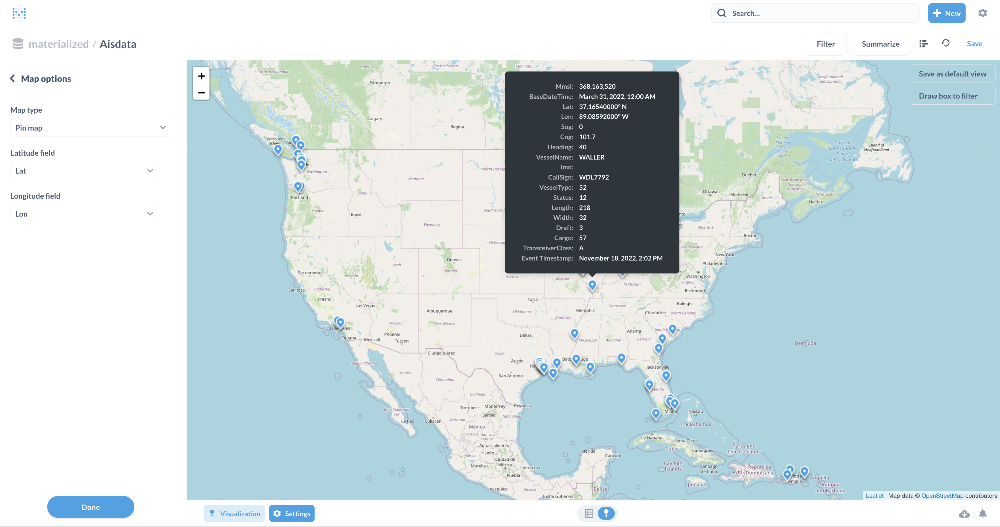

