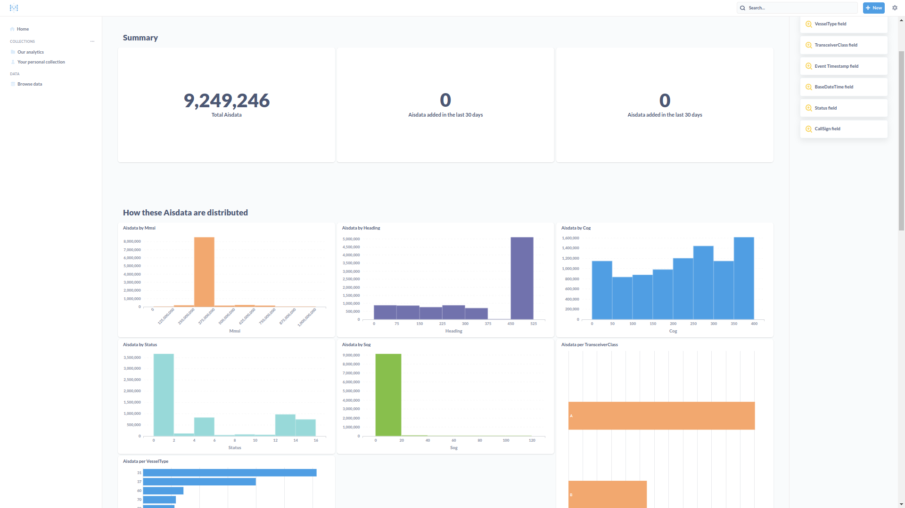

# materialize-dbt-example
Ingests AIS data in Materialized and displays contents via Metabase

# AIS
https://marinecadastre.gov/ais/


## Raw Data Metadata
https://coast.noaa.gov/data/marinecadastre/ais/data-dictionary.pdf


## Raw data





# Ingest

# dbt

## init
```
$ docker-compose run dbt init 
10:25:39  Running with dbt=1.2.0
Enter a name for your project (letters, digits, underscore): example
Which database would you like to use?
[1] postgres

(Don't see the one you want? https://docs.getdbt.com/docs/available-adapters)

Enter a number: 1
10:25:52  Profile example written to /root/.dbt/profiles.yml using target's sample configuration. Once updated, you'll be able to start developing with dbt.
10:25:52  
Your new dbt project "example" was created!

For more information on how to configure the profiles.yml file,
please consult the dbt documentation here:

  https://docs.getdbt.com/docs/configure-your-profile

One more thing:

Need help? Don't hesitate to reach out to us via GitHub issues or on Slack:

  https://community.getdbt.com/

Happy modeling!
```
